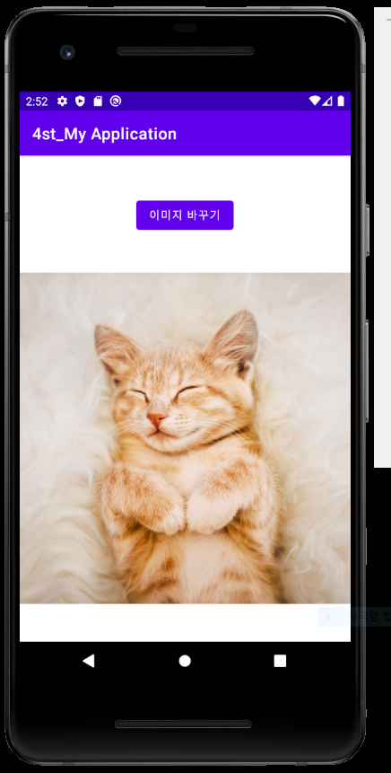

# 20173027김민정

## 1주차과제

## 2주차과제

  </img>

## 3주차과제

</img>
</img>

## 4주차과제

-굿모닝루틴(Good morning routine)-

오늘 하루를 잘 보내려면 첫 한시간을 잘 보내야한다고 합니다. 하지만 현대인들의 하루 일과는 핸드폰 확인으로 시작합니다. 알림, 공유, 좋아요, 다양한 영상들로 인해 정신은 흩어지며 뇌는 혼잡해집니다. 제가 만들 '굿모닝루틴'은 이런것들에 방해받지 않고 스스로 하루를 설립 할 수 있게 도와줍니다. 정확히 말하자면, 성공하는 사람들의 모닝 루틴을 모방하여 유저에게 오늘의 목표와 올바른 방향을 정할 수 있도록 관리해주는 앱입니다. 성공하는 사람들의 모닝 루틴은 이러합니다. 
1. 아침 일찍 일어나기
2. 오늘 꿈 꿈을 되돌아보기
3. 침대 정리
4. 물 한 컵 마시기 (영양제 섭취는 선택)
5. 호흡하기
6. 명상하기
7. 1-2분간 간단한 운동
8. 찬물샤워
9. 차를 마시면서 일기 작성
10. To Do, To Be 리스트 작성
11. 20-30분간 독서

'굿모닝루틴' 앱에서는 유저가 이 습관을 순서대로 이행 할 수 있도록 이끌것입니다. 예를들어 이런 것입니다.
이른 아침 '굿모닝루틴' 유저가 앱에서 설정한 기상알람을 종료하는 순간 이 앱과 다른 필수적인 앱을 제외한 핸드폰의 나머지 기능은 셧다운됩니다. 그때부터 모닝루틴은 시작되고 하나의 습관을 성공 할 때 마다 순차적으로 다음 단계를 할 수 있게 도와줍니다. 유저가 이 루틴을 보다 편리하게 성공하기 위해서 몇 가지 기능을 추가할 것입니다. 

-이른 아침, 늦잠을 자지 않도록 도와주는 '알람 기능'

-되돌아 본 꿈의 내용을 기록하기 원하는 유저를 위한 '메모 기능'

-5, 6단계에서 한 층 더 차분한 심리상태를 이루어주는 '힐링 음악 재생 기능'

-7단계에서 참고 할 수 있는 다양한 '운동 방법 기능' 

-9, 10단계에서 종이가 아닌 온라인상 작성을 선호하는 유저를 위한 '일기 작성 기능', 'To Do, To Be 리스트 작성 기능'

지금 제 능력으로 이 기능들을 실현하기 쉽지 않겠지만, 생각하고 있는 앱 기획 아이디어상으론 이렇습니다! 이상입니다. 긴 글 읽어주셔서 감사합니다.

## 5주차 과제
</img>
</img>

## 6주차 과제
</img>
</img>
</img>
